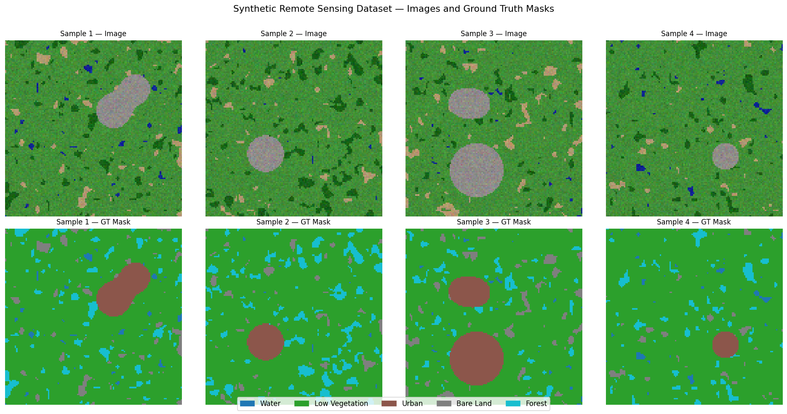
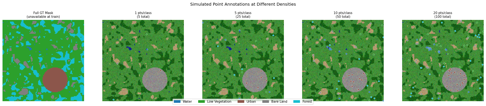
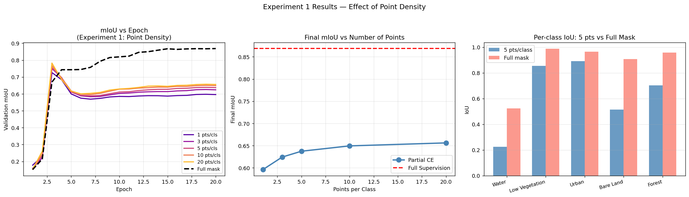
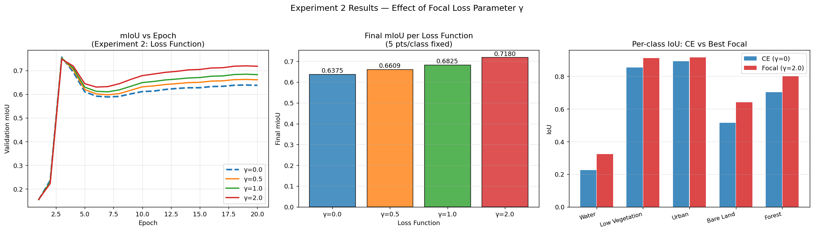
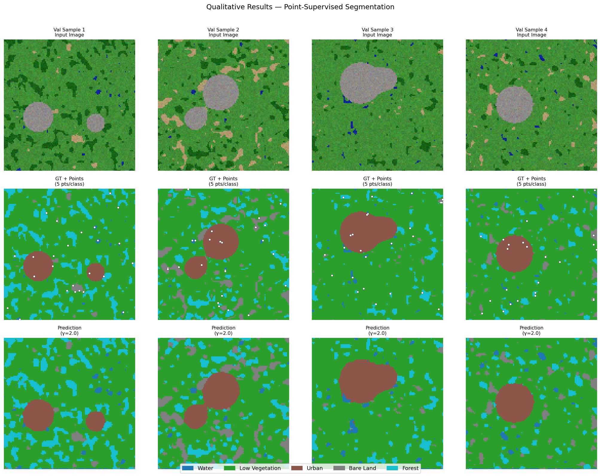

# Point-Supervised Remote Sensing Segmentation
### Using Partial Cross Entropy Loss

A deep learning solution for semantic segmentation of remote sensing imagery trained with **point-level annotations** — replacing expensive full pixel-wise masks with a handful of clicked points per image.

---

## Problem Statement

Semantic segmentation of satellite and aerial imagery requires classifying every pixel into a land-cover category (water, vegetation, urban, etc.). Standard deep learning approaches require **complete pixel-wise masks** during training — an annotation process that is slow, expensive, and impractical at scale.

This project addresses a far more realistic scenario: training with **point-level supervision**, where a human annotator clicks only a few representative pixels per class per image. This yields less than 0.2% of pixels labeled, yet the model must learn to predict dense segmentation across the entire image.

The core challenge: most loss functions assume all pixels are labeled. We need a custom loss that gracefully handles the 99.8% of unlabeled pixels.

---

## Solution — Partial Cross Entropy Loss (pfCE)

We implement a custom **Partial Cross Entropy Loss** that computes gradients **only at labeled pixel positions**, masking out everything else:

$$pfCE = \frac{\sum \big(\text{FocalLoss}(\hat{y}, y) \times \text{MASK}_{labeled}\big)}{\sum \text{MASK}_{labeled}}$$

Two variants are implemented:

- **Partial CE** — standard cross-entropy applied only to labeled pixels
- **Partial Focal CE** — adds focal weighting `(1 − pₜ)^γ` to shift learning toward hard, misclassified examples

The normalization by `Σ MASK_labeled` keeps gradients stable regardless of how sparse the mask is.

> **Verified:** With a full mask, Partial CE = Standard CE = **1.9828** exactly.

---

## Methodology

### Dataset
A synthetic remote sensing dataset (100 train / 30 val, 128×128) simulating aerial land-cover imagery with 5 classes:

| Class | Description | Pixel frequency |
|-------|-------------|:---------------:|
| Water | Blue spectral signature | 0.5% |
| Low Vegetation | Bright green | 75.1% |
| Urban / Built-up | Gray | 7.8% |
| Bare Land | Tan / Brown | 4.3% |
| Forest | Dark green | 12.3% |

The dataset is **severely class-imbalanced** — Low Vegetation covers 75% of pixels while Water covers only 0.5%. This imbalance is the key motivation for Focal loss.



### Point Label Simulation
Full masks are available only to simulate the annotation process. For each image, K pixels are randomly sampled per class — all other pixels are ignored during training.



*From left: full ground-truth mask (unavailable at training time), then point annotations at 1, 5, 10, and 20 pts/class overlaid on the image.*

### Model — U-Net
A lightweight U-Net (3 encoder/decoder levels, 32 base channels, **1.93 M parameters**) trained from scratch:
- Adam optimizer, lr = 2e-4, weight decay = 1e-5
- Cosine annealing LR schedule
- Batch size = 8, 20 epochs per run, CPU only

---

## Experiments

### Experiment 1 — Effect of Point Density

**Hypothesis:** More labeled points → higher mIoU, with diminishing returns.

Six models trained at densities of 1, 3, 5, 10, 20 pts/class and a full-mask baseline — all other settings fixed.

| Points / class | % pixels labeled | Val mIoU | Gap vs full mask |
|:--------------:|:----------------:|:--------:|:----------------:|
| 1 | ~0.04% | 0.5961 | −0.2725 |
| 3 | ~0.12% | 0.6243 | −0.2444 |
| 5 | ~0.20% | 0.6375 | −0.2312 |
| 10 | ~0.39% | 0.6495 | −0.2192 |
| 20 | ~0.78% | 0.6562 | −0.2124 |
| Full mask | 100% | **0.8687** | — |



**Finding:** mIoU improves monotonically but gains flatten after ~10 pts/class. Only +0.007 improvement going from 10→20 pts, vs +0.028 from 1→3 pts. The persistent gap to full supervision motivates Experiment 2.

---

### Experiment 2 — CE Loss vs Focal CE Loss

**Hypothesis:** Given the severe class imbalance (Low Vegetation = 75.1%), focal weighting should shift the gradient budget toward rare classes (Water = 0.5%, Bare Land = 4.3%), improving overall mIoU.

Four models trained at fixed 5 pts/class, varying gamma in {0.0, 0.5, 1.0, 2.0}.

| Loss Function | gamma | Val mIoU | Gain vs CE |
|:-------------:|:-----:|:--------:|:----------:|
| Partial CE | 0.0 | 0.6375 | — |
| Partial Focal CE | 0.5 | 0.6609 | +0.0234 |
| Partial Focal CE | 1.0 | 0.6825 | +0.0450 |
| Partial Focal CE | **2.0** | **0.7180** | **+0.0805** |



**Finding:** Focal CE with gamma=2.0 at 5 pts/class (mIoU=**0.7180**) outperforms standard CE even at 20 pts/class (0.6562). The loss function delivers a larger gain than quadrupling the annotation budget.

---

## Qualitative Results

Predictions from the best model (5 pts/class, Focal CE gamma=2.0, mIoU=0.7180):



*Row 1: Input satellite image. Row 2: Ground-truth mask with point annotations (white dots). Row 3: Model prediction.*

---

## Conclusions

1. **Partial CE loss** is a simple, principled way to train segmentation networks with point annotations — no architectural changes needed, only a different loss function.

2. **Point density matters** but with strong diminishing returns. 10 pts/class recovers nearly as much as 20 pts/class, suggesting a practical sweet spot around 5–10 points per class.

3. **The loss function matters more than more labels.** Focal CE (gamma=2.0) at 5 pts/class (mIoU=0.7180) beats standard CE at 20 pts/class (0.6562). On severely imbalanced datasets, choosing the right loss is the highest-leverage decision.

4. **Best result:** 5 pts/class + Partial Focal CE (gamma=2.0) → mIoU = **0.7180**, recovering **~81% of full-supervision performance** while labeling **less than 0.2% of pixels**.

5. The remaining gap motivates future work on semi-supervised strategies such as pseudo-labeling unlabeled pixels and iterative self-training.

---

## Project Structure

```
.
├── partial_ce_segmentation.ipynb   # Full implementation + experiments (self-contained)
├── fig_dataset_samples.png         # Synthetic dataset visualization
├── fig_point_labels.png            # Point annotation densities
├── fig_exp1_results.png            # Experiment 1 — point density results
├── fig_exp2_results.png            # Experiment 2 — focal loss results
└── fig_qualitative.png             # Qualitative segmentation predictions
```

## Requirements

```bash
pip install torch torchvision matplotlib numpy scikit-learn tqdm pillow
```

No GPU required. No dataset downloads needed. All experiments run on CPU in under 15 minutes.

---

*Built with PyTorch 2.12 · U-Net trained from scratch · No pretrained weights*